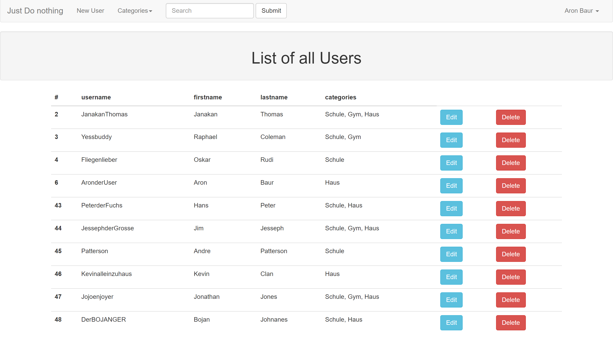
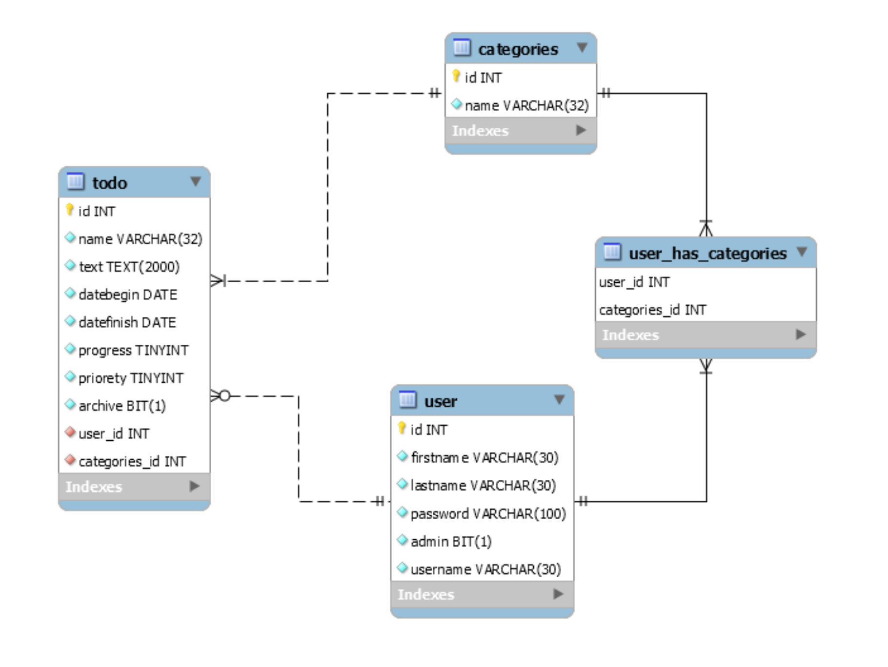

# Just do nothing
is a very boring and not very Unique WebApp.

## About
This is a boring WebApp. You have to Login to use the App. There are two types of Users.
Admins can delete, edit and create users, but don't have acces to the userspace.
User can create, edit and delete ToDo's. Every ToDo has a categorie, only Users with acces to the ToDo's Categorie can see them.
Only the create of a ToDO can edit it.

## How to use

### Admin Login
Username: AronderAdmin

Password: Adminpasswort123$
### Database
ERM of the Database if you wanna recreate this

